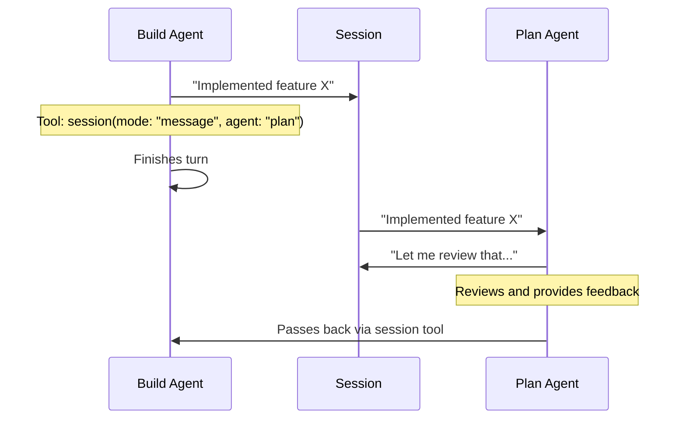
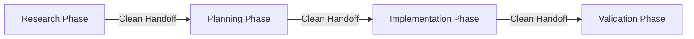
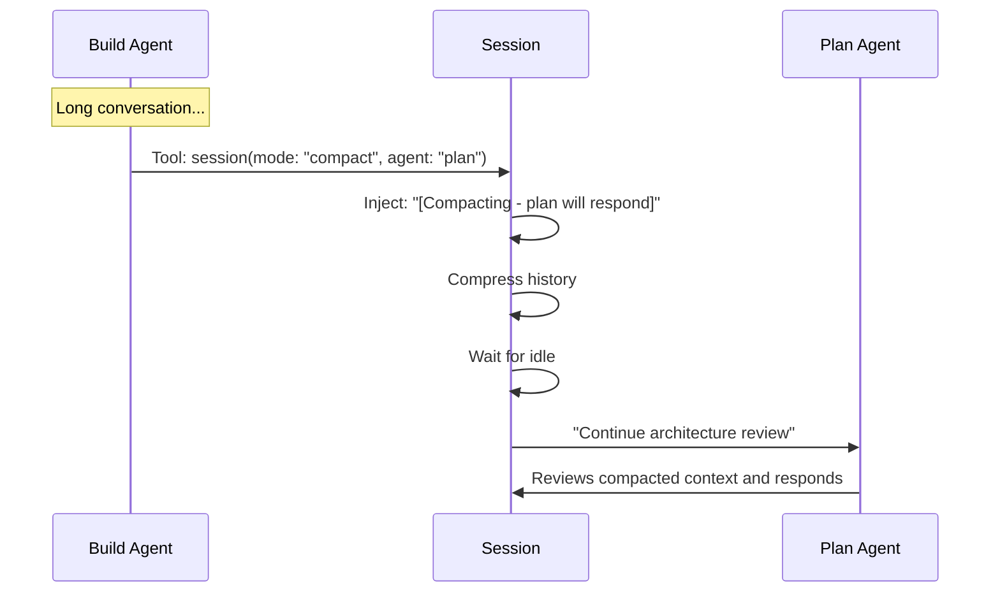
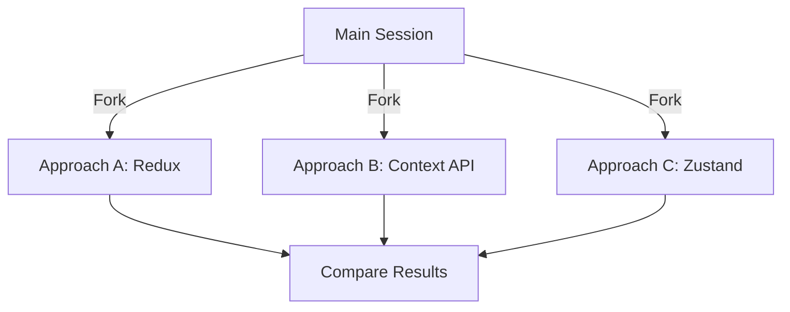

# OpenCode Sessions

[](https://www.npmjs.com/package/opencode-sessions)
[](https://opensource.org/licenses/MIT)

> **Multi-agent collaboration and workflow orchestration for OpenCode**

Enable turn-based agent collaboration, clean phase transitions, manual compression control, and parallel exploration—all through a single elegant tool.

---

## The Four Pillars

### 🤝 **COLLABORATE** — Turn-Based Agent Discussion

Agents work together in the same conversation, passing the torch back and forth. Perfect for complex problems requiring multiple perspectives.

```typescript
session({
  mode: "message",
  agent: "plan",
  text: "Should we use microservices here?",
})
// Plan agent reviews architecture and responds
// Can pass back to build agent for implementation
```



**Use Cases:**

- Complex problem-solving requiring multiple viewpoints
- Code review workflows (build → plan → build)
- Architecture discussions (plan ↔ researcher)
- Iterative refinement across agents

---

### 🎯 **HANDOFF** — Clean Phase Transitions

Complete one work phase, hand off to another agent with a fresh slate. No context baggage from previous work.

```typescript
session({
  mode: "new",
  agent: "researcher",
  text: "Research API design best practices for 2025",
})
// Fresh session, clean context
// Previous implementation details don't influence research
```



**Use Cases:**

- Research → Planning → Implementation → Validation workflows
- Preventing context bleed between phases
- Starting unrelated tasks
- Running slash commands in clean context

---

### 🗜️ **COMPRESS** — Manual Compression with Messaging

Trigger compaction when needed, include a message, and optionally hand off to a different agent. Maintain long conversations without token limits.

```typescript
session({
  mode: "compact",
  agent: "plan",
  text: "Continue architecture review",
})
// Compacts history, injects handoff context, plan agent responds
```



**What survives compaction:**

- ✅ Handoff context message: `[Compacting session - plan agent will respond after completion]`
- ✅ Your actual message
- ✅ Compacted summary of previous work

**Use Cases:**

- Long conversations approaching token limits
- Preserving context while freeing memory
- Handing off with compression
- Continuing work without losing essential history

---

### 🔀 **PARALLELIZE** — Explore Multiple Approaches

Branch into independent sessions to try different solutions. Full primary agent capabilities in each fork.

```typescript
// Try approach A
session({
  mode: "fork",
  agent: "build",
  text: "Implement using Redux",
})

// Try approach B
session({
  mode: "fork",
  agent: "build",
  text: "Implement using Context API",
})

// Compare results, pick the best
```



**Use Cases:**

- Exploring alternative solutions
- Comparing different approaches
- "What if" scenario analysis
- Risk-free experimentation with full agent capabilities

---

## Installation

**Requirements:** OpenCode ≥ 0.15.18

Add to your `opencode.json` or `~/.config/opencode/opencode.json`:

```json
{
  "plugin": ["opencode-sessions"]
}
```

OpenCode auto-installs plugins on startup.

### Version Pinning

Pin to a specific version:

```json
{
  "plugin": ["opencode-sessions@x.y.z"]
}
```

### Updates

Check installed version:

```bash
cat ~/.cache/opencode/node_modules/opencode-sessions/package.json | grep version
```

Force update to latest:

```bash
rm -rf ~/.cache/opencode && opencode
```

---

## Usage

### Basic Syntax

```typescript
session({
  text: string,      // Required - message to send
  mode: string,      // Required - "message" | "new" | "compact" | "fork"
  agent?: string     // Optional - target agent name
})
```

### Available Agents

The plugin automatically discovers your configured agents:

```typescript
// Built-in agents (always available):
- build -      // Full development capabilities with all tools
- plan -       // Analysis and planning (read-only tools)
// Plus any custom agents from your configuration
- researcher - // Research and investigation
- implement -  // Implementation-focused
```

Use Tab in OpenCode to see all available agents.

---

## Real-World Examples

### Example 1: Code Review Workflow

```typescript
// Build agent implements
session({
  mode: "message",
  agent: "build",
  text: "Implemented the user authentication system",
})

// Build passes to plan for review
session({
  mode: "message",
  agent: "plan",
  text: "Review the authentication implementation for security issues",
})

// Plan provides feedback, passes back to build
session({
  mode: "message",
  agent: "build",
  text: "Address the CSRF vulnerability mentioned above",
})
```

### Example 2: Research → Plan → Implement Pipeline

```typescript
// Phase 1: Research (clean start)
session({
  mode: "new",
  agent: "researcher",
  text: "Research best practices for API rate limiting in 2025",
})

// Phase 2: Planning (clean handoff)
session({
  mode: "new",
  agent: "plan",
  text: "Design a rate limiting system based on the research",
})

// Phase 3: Implementation (clean handoff)
session({
  mode: "new",
  agent: "build",
  text: "Implement the rate limiting system per the plan",
})
```

### Example 3: Long Conversation with Compression

```typescript
// After extensive back-and-forth implementation discussion...

// Compress and hand off to plan for architectural review
session({
  mode: "compact",
  agent: "plan",
  text: "Review the overall architecture we've built so far",
})

// Plan sees:
// [Compacted history of implementation]
// User: [Compacting session - plan agent will respond after completion]
// User: Review the overall architecture we've built so far
```

### Example 4: Parallel Approach Exploration

```typescript
// Current session: discussing database choice

// Fork A: Try PostgreSQL approach
session({
  mode: "fork",
  agent: "build",
  text: "Implement data layer using PostgreSQL with Prisma",
})

// Fork B: Try MongoDB approach
session({
  mode: "fork",
  agent: "build",
  text: "Implement data layer using MongoDB with Mongoose",
})

// Fork C: Try serverless approach
session({
  mode: "fork",
  agent: "build",
  text: "Implement data layer using DynamoDB",
})

// Each fork explores independently with full context
// Compare results using <leader>l to switch between sessions
```

---

## How It Works

### The Agent Relay Pattern

When you call the session tool with `mode: "message"` or `mode: "compact"`:

1. **Tool stores your message** in a pending queue
2. **Current agent finishes** its turn naturally
3. **`session.idle` event fires** after the session unlocks
4. **Plugin sends the queued message** to the target agent
5. **Target agent receives** the message as a USER message
6. **Target agent responds** in the same conversation

This pattern ensures:

- ✅ No deadlocks (tool returns immediately)
- ✅ Agent parameter preserved (sent after unlock)
- ✅ Clean turn-taking (one agent at a time)
- ✅ Full context visibility (same conversation)

### Why Turn-Based?

Agents don't interrupt each other. Each agent gets a complete turn to:

- See the full conversation history
- Make tool calls and get results
- Formulate a complete response
- Optionally pass to another agent

This creates **structured collaboration** rather than chaotic multi-agent interference.

---

## API Reference

### Tool: session

**Arguments:**

| Argument | Type   | Required | Description                                                       |
| -------- | ------ | -------- | ----------------------------------------------------------------- |
| `text`   | string | ✅ Yes   | Message to send                                                   |
| `mode`   | enum   | ✅ Yes   | Operation mode: `"message"` \| `"new"` \| `"compact"` \| `"fork"` |
| `agent`  | string | ❌ No    | Target agent name (defaults to current agent)                     |

**Returns:** Status message describing the operation

**Mode Details:**

| Mode      | Creates New Session | Agent Switching | Context Preserved | Use Case             |
| --------- | ------------------- | --------------- | ----------------- | -------------------- |
| `message` | No                  | Yes             | Yes               | Agent collaboration  |
| `new`     | Yes                 | Yes             | No                | Phase transitions    |
| `compact` | No                  | Yes             | Compressed        | Token optimization   |
| `fork`    | Yes (child)         | Yes             | Yes               | Parallel exploration |

---

## Troubleshooting

**Tool not appearing?**

- Verify OpenCode version ≥ 0.15.18
- Check plugin installed: `ls ~/.cache/opencode/node_modules/opencode-sessions`
- Restart OpenCode after installation

**Agent switching not working?**

- Verify agent name exists (use Tab to see available agents)
- Check for typos (agent names are case-sensitive)
- Ensure OpenCode SDK is up to date

**Session operations failing?**

- Check error notifications in OpenCode TUI
- Verify you're in an active session

---

## Contributing

Contributions welcome! See [CONTRIBUTING.md](CONTRIBUTING.md) for guidelines.

---

## License

MIT - see [LICENSE](LICENSE)

---

## Learn More

- [OpenCode Documentation](https://opencode.ai)
- [Plugin API Reference](https://opencode.ai/docs/plugins)

---

<div align="center">

**Not affiliated with Anthropic or OpenCode.**  
This is an independent open-source project.

Made with ❤️ for the OpenCode community

</div>
